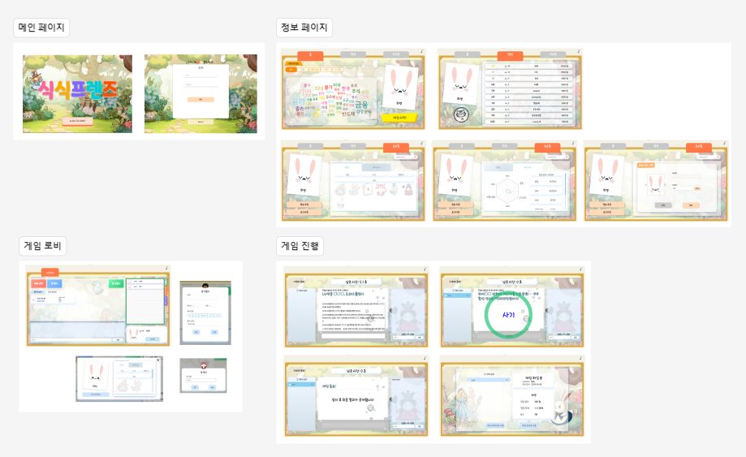
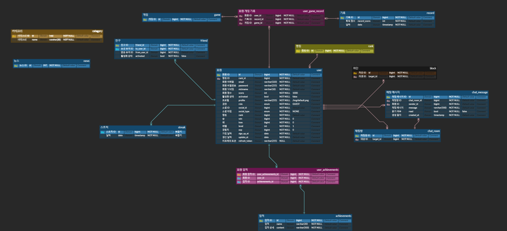

# 🐰식식프렌즈🐰

### | 데일리 뉴스의 주요 키워드를 맞추는 퀴즈 게임 서비스

### 📆 프로젝트 기간

2023.08.28 ~ 2023.10.06 (6주)

## 목차

<!-- - [🎯 기획배경](#subject) -->

[⭐️ 주요 기능](#mainContents)
[🛠️ 기술 스택](#skills)
[💾 데이터 파이프라인](#dataPipelines)
[🗂️ 시스템 아키텍쳐](#systemArchitecture)
[📋 설계 산출물 및 관련 문서](#design)
[👪 팀원 소개](#members)

<!-- # 🎯 기획 배경

기획 배경 -->

## ⭐️ 주요 기능

### 1. 메인 화면

- 다양한 애니메이션 효과와 배경음악을 사용하여 밝고 신나는 분위기를 완성했습니다.

- 우측 상단에 배경 음악 ON/OFF 버튼

- 로그인 및 회원가입 토글 애니메이션 효과

### 2. 워드 클라우드

- 데일리 뉴스를 분석하여 키워드를 추출하고 이를 워드클라우드로 표현하였습니다.

- 워드클라우드는 5개의 카테고리(경제, 사회, 생활/문화, 세계, IT/과학)로 제공합니다.

### 3. 대기실

- 웹 소켓을 사용하여 게임 대기실 내 유저와 생성된 방 정보를 확인할 수 있습니다.

- 대기실 내의 유저들은 채팅창을 통해 소통이 가능합니다.

- 대기실 내 유저들의 프로필을 확인할 수 있습니다.

- 유저에게 친구 요청을 보낼 수 있으며, 요청을 수락하면 서로 친구가 됩니다.

- 생성된 모든 방과 대기중인 방을 확인할 수 있습니다.

### 4. 게임

- 출제 뉴스 날짜, 문제 갯수, 참여 인원을 선택해 게임방을 생성할 수 있습니다.

- 뉴스 데이터로 생성된 문제와 정답이 차례로 화면에 보여집니다.

- 한 문제당 획득한 점수에 따라 현재 순위가 화면에 보여집니다.

- 게임 중인 유저와 채팅을 주고받을 수 있습니다.

### 5. 랭킹

- 전체 상위 10위 랭킹을 확인할 수 있습니다.

- 좌측에는 자신의 프로필과 랭킹 정보가 보여집니다.

- 닉네임을 클릭하면 해당 유저의 프로필로 이동합니다.

### 6. 프로필

- 프로필 정보 확인 및 정보 수정, 로그아웃이 가능합니다.

- 정보: 프로필 사진, 닉네임, 랭킹, 수집 뱃지 등에 관한 정보를 확인할 수 있습니다.

- 데이터: 전체 및 카테고리 별 정답률을 차트로 확인할 수 있습니다.

- 오답노트: 참여한 게임방의 문제를 다시 풀어볼 수 있습니다.

- 닉네임 검색을 통해 다른 유저의 프로필로 이동합니다.

## 🛠️ 기술 스택

### 공통

### Front-End

### Back-End

### Data

### Server

## 💾 데이터 파이프라인

- 24시간을 주기로 새로운 뉴스 데이터를 크롤링합니다.

- 수집한 뉴스 데이터는 HDFS에 저장하여 문제 생성에 사용될 수 있게 하였고, 동시에 키워드를 추출하여 워드 클라우드로 생성했습니다.

- 생성된 워드 클라우드 데이터는 MongoDB에 저장하여 백엔드 서버에서 워드 클라우드 API생성에 사용할 수 있게 하였습니다.

- 이 모든 일련의 과정은 Airflow를 활용하여 24시간마다 자동으로 수행했습니다.

## 🗂️ 시스템 아키텍쳐

### 메인 서버(좌) | 분산 클러스터링 서버(우)

- AWS EC2 t2.xlarge 인스턴스

- Ubuntu 20.04

## 📋 설계 산출물 및 관련 문서

### 요구사항 정의

### 화면 설계서

### ER Diagram

### 프로젝트 관련 문서

<table>
    <tr>
        <td>
        <b>구분</b>
        </td>
        <td>
        <b>링크</b>
        </td>
    </tr>
    <tr>
        <td>
        포팅 매뉴얼 및 시연 시나리오
        </td>
        <td>
        <a src="/exec/포팅_매뉴얼_및_시연_시나리오.docx">포팅 매뉴얼 및 시연 시나리오 바로가기</a>
        </td>
    </tr>
    <tr>
        <td>
        DB 덤프 데이터
        </td>
        <td>
        <a src="/exec/sql/">DB 덤프 데이터 바로가기</a>
        </td>
    </tr>
    <tr>
        <td>
        UCC
        </td>
        <td>
        <a src="https://youtu.be/NUaRz1khf-c" alt="식식프렌즈UCC">UCC 바로가기</a>
        </td>
    </tr>
</table>

## 👪 팀원 소개

<table>
    <tr>
        <td height="140px" align="center"> <a href="https://github.com/hi9900">
                👑 구희영 </a>  </td>
            <td height="140px" align="center"> <a href="https://github.com/PassionSoftIan">
                권인식  </a>  </td>
        <td height="140px" align="center"> <a href="https://github.com/kimta2hwan">
                김태환 </a>  </td>
        <td height="140px" align="center"> <a href="https://github.com/sl39">
                이세울 </a>  </td>
        <td height="140px" align="center"> <a href="https://github.com/nayeonxkim">
                김나연  </a>  </td>
        <td height="140px" align="center"> <a href="https://github.com/StarSein">
                황유성  </a>  </td>
    </tr>
    <tr>
        <td align="center">
        UI/UX 로그인 랭킹 친구 마이페이지 
        </td>
        <td align="center">
        PM Server CI/CD Game Socket
        </td>
        <td align="center">
        MSA 총괄 Auth Member 
        </td>
        <td align="center">
        Member 회원가입 대기실 실시간 게임 
        </td>
        <td align="center">
        Data Pipeline 구축 hadoop cluster 데이터 수집 데이터 저장
        </td>
        <td align="center">
        자연어처리 워드 클라우드 퀴즈 생성
        </td>
    </tr>
</table>
